<!--

-->

 

This is the companion website of the paper 
[Vector Quantized Contrastive Predictive Coding for Template-based
Music Generation](https://arxiv.org/abs/2004.10120) by Hadjeres and Crestel.
 

In this paper, we proposed a flexible method for generating variations of discrete sequences 
in which tokens can be grouped into basic units, like sentences in a text or bars in music.
More precisely, given a template sequence, we aim at producing novel sequences sharing perceptible similarities 
with the original template without relying on any annotation. The
novelty of our approach is to cast the problem of generating
variations as a representation learning problem.

We introduce 
 - a *self-supervised encoding* technique, named *Vector-Quantized Contrastive Predictive Coding* (*VQ-CPC*), 
which allows to learn a meaningful assignment of the basic units over a discrete set of codes,
together with  mechanisms allowing to control the information content
of these learnt discrete representations,
- an appropriate *decoder* architecture which can generate sequences
  from the compressed representations learned by the encoder.
  
VQ-CPC consists in the introduction of a quantization bottleneck in
the [Contrastive Predictive Coding](https://arxiv.org/abs/1807.03748) (CPC) objective. Contrary to other
approaches like [VQ-VAE](https://arxiv.org/abs/1711.00937) which aim at obtaining perfect reconstructions
and are trained by minimizing a likelihood-based loss, we choose
instead to
highly-compress our representations and consider codebooks orders of
magnitude smaller than these approaches (typically 8 or 16) and
maximize a different objective. We show that our approach allows to
obtain a meanigful clustering of the basic units and that this
clustering can then be used in a generation perspective. Moreover, we
are able to emphasize the importance of the sampling distribution of
the negative samples in the CPC objective on the learnt clusters.

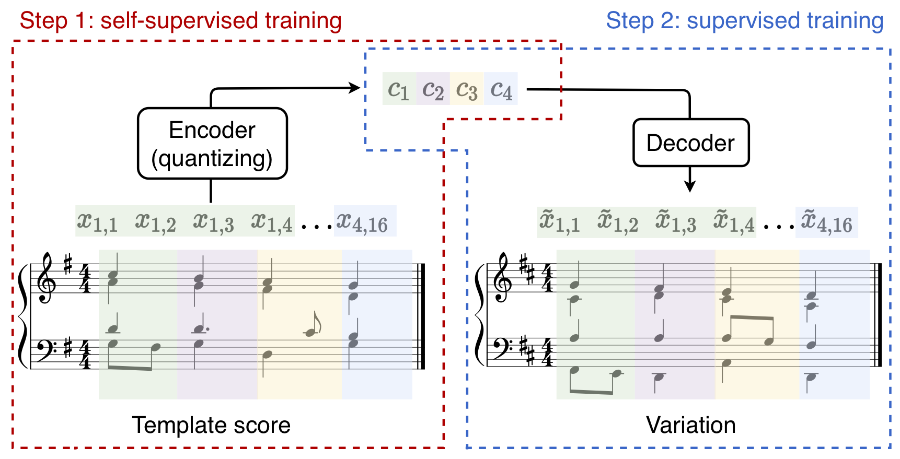

We applied our technique on the corpus of J.S. Bach chorales to derive a generative model  particularly well-suited for generating variations of a given input chorale.
Our experiments can be reproduced using our [Github repository](https://github.com/SonyCSLParis/vqcpc-bach).

The results of our experiments are presented in the following sections
  * [Clusters](#clusters)
  * [Generating Variations](#examples-in-the-paper)
  * [Variations of a template chorale](#variations-of-a-source-piece)

___
# Clusters 
The encoder simply learns to map subsequences of a time series to a label belonging to a discrete alphabet.
In other words, **an encoder defines a clustering of the space of subsequences**.
This clustering is learned in a self-supervised manner, by optimising a contrastive objective.

In our experiment, we considered Bach chorales.
We chose to define a structuring element as **one beat of a four voices chorale**. 
Note that there is no restriction in using fixed length structuring elements, 
and variable lengths could be used in other applications such as natural language processing.

In the following animated pictures, **each frame represents one cluster**,
and **each bar represents one structuring element** belonging to that cluster. 
A limited number of clusters and elements are diplayed on this site. 
More examples can be downloaded here [clusters.zip](exemples/clusters/clusters.zip).

In our article, we explored three different self-supervised training
objectives:
*VQ-CPC-Uniform*, where the  negative samples are drawn uniformly from
the dataset and
*VQ-CPC-SameSeq*, where the negative samples are drawn from the same
chorale as the positive samples. We compared these two approaches with 
what we termed a *Distilled VQ-VAE* inspired from the [Hierarchical
Autoregressive Image Models with Auxiliary
Decoders](https://arxiv.org/abs/1903.04933) by De Fauw et al.

Each of them led to a different type of clustering which we display below:

## Clusters obtained with the *VQ-CPC-Uniform* model
The negative examples in the contrastive objective are sampled randomly among all chorales.
Since chorales have been written in all possible key signatures and we used transposition as a data augmentation,
an easy way to discriminate the positive examples from the negatives is to look at the alterations.
Hence, the clusters are often composed by elements which can lie in the same or a related key.

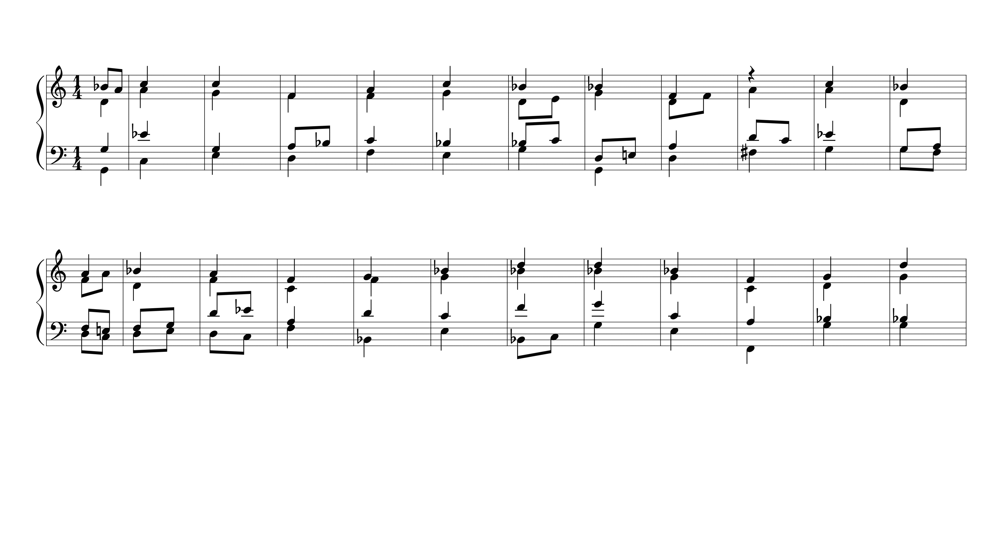

## Clusters obtained with the *VQ-CPC-SameSeq* model
The negative examples in the contrastive objective are sampled in the same-sequence as the positive example, 
but at different locations (either before or after the position of the positive).
In that case, the contrastive objective is similar to learning to sort the elements of the score in a chronological order.  
In that case, the key is no longer a discriminative feature of the positive example.
On the contrary, the harmonic function is an informative indicator of the position of a chord in a phrase.
Hence, clusters tend to contain elements which could share similar harmonic functions.
 
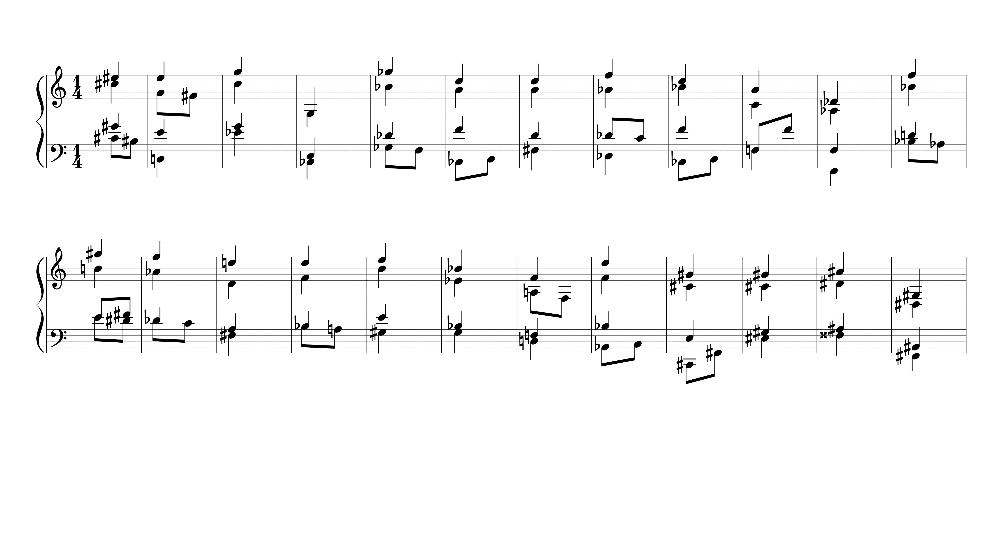

## Clusters obtained with the *Distilled VQ-VAE* model
With the Distilled VQ-VAE model, the discrete codes are trained to
minimize a likelihood-based loss. As a result, the encoder tends to
focus on capturing the key of the fragments, as was the case with the
*VQ-CPC* codes with random negative sampling. However, we observe that
the range of the soprano voice is also captured: the maximal range of
the soprano part in a given cluster is not greater than a sixth. This
behaviour can be explained as the soprano voice tends to be more regular
than the other voices in the particular case of Bach chorales (it is
often composed of conjunct notes).
 
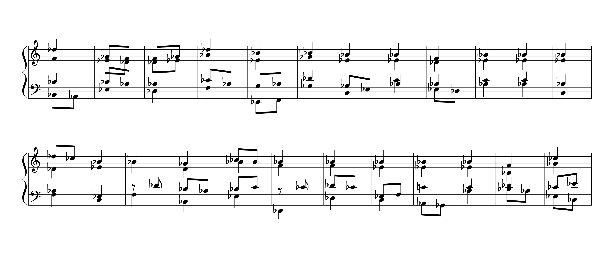

---

# Generating variations 
When the encoders are trained, we can then train a decoder to
reconstruct the original chorale given its sequence of codes. Because
we limited to 16 the total number of different codes, perfect reconstruction
is almost impossible. This results in the possibility to generate
variations of a template chorale simply by computing its sequence of
codes and then decoding it. The decoded chorale will share perceptual
similarities with the template chorale and these similarities will
depend on what information is contained in the codes.

In the following, we provide variations of a 6-bar template chorale
for the three different methods we considered.

## Variations obtained from *VQ-CPC-Uniform* codes
Example #1:
<table>
<tr>
<td>

</td>
</tr>
<tr>
<td>

<audio controls>
<source src="exemples/variations_random/2020-04-17_07-53-10.mp3">
</audio>

</td>
</tr>
</table>

 
Example #2:
<table>
<tr>
<td>
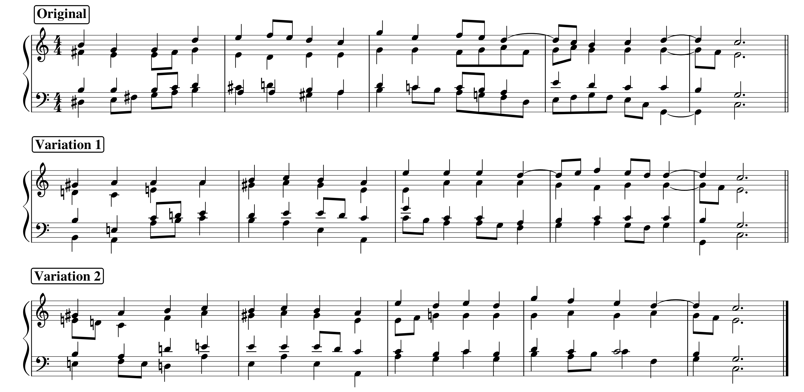
</td>
</tr>
<tr>
<td>

<audio controls>
<source src="exemples/variations_random/2020-04-15_07-59-25.mp3">
</audio>

</td>
</tr>
</table>

 
---
## Variations obtained from *VQ-CPC-SameSeq* codes
Example #1:
<table>
<tr>
<td>

</td>
</tr>
<tr>
<td>

<audio controls>
<source src="exemples/variations_random/2020-04-17_07-53-10.mp3">
</audio>

</td>
</tr>
</table>
 

Example #2:
<table>
<tr>
<td>

</td>
</tr>
<tr>
<td>

<audio controls>
<source src="exemples/variations_random/2020-04-17_07-53-10.mp3">
</audio>

</td>
</tr>
</table>
 

---

## Variations obtained from *Distilled VQ-VAE* codes
Example #1:
<table>
<tr>
<td>
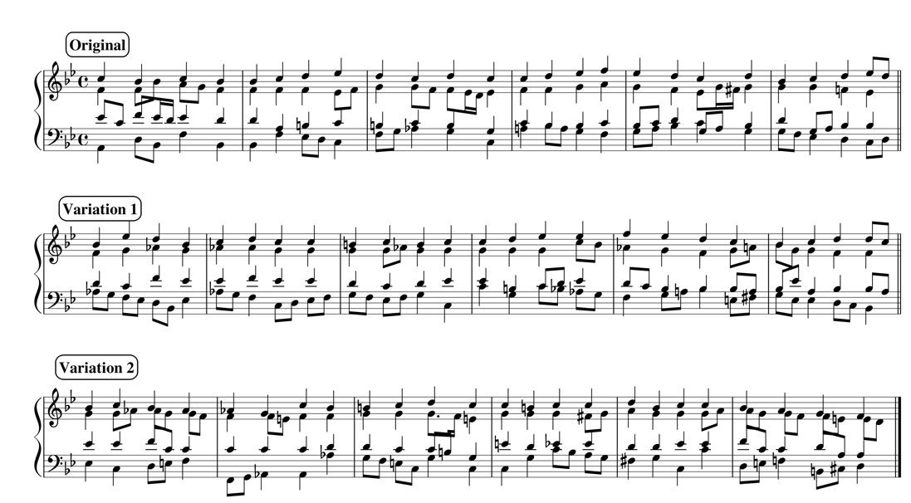
</td>
</tr>
<tr>
<td>

<audio controls>
<source src="exemples/variations_distill/Variations_distill_1_val.ogg">
</audio>

</td>
</tr>
</table>

 
Example #2:
<table>
<tr>
<td>
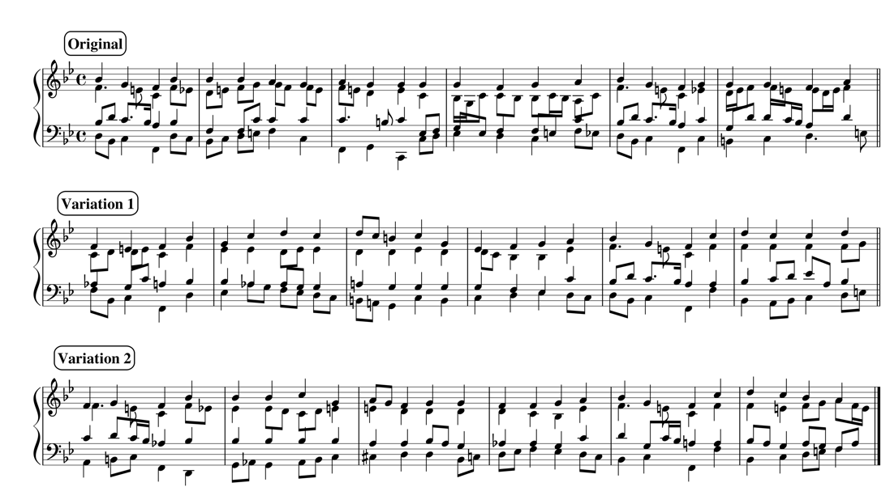
</td>
</tr>
<tr>
<td>

<audio controls>
<source src="exemples/variations_distill/Variations_distill_1_train.ogg">
</audio>

</td>
</tr>
</table>

___
# Variations of a template chorale 
We provide additional examples of variations. In this section, we
generate variations based on a full template chorale by using the
models from the preceding section with a sliding window.

## Variations of a full chorale with *VQ-CPC-SameSeq*
Original chorale:

<table>
<tr>
<td>
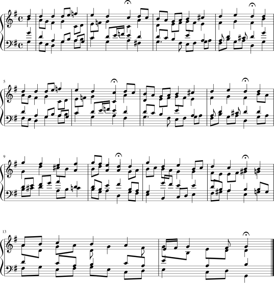
</td>
</tr>
<tr>
<td>

<audio controls>
<source src="exemples/reharmonizations_distill/BWV215_original.ogg">
</audio>

</td>
</tr>
</table>

Variation #1:

<table>
<tr>
<td>
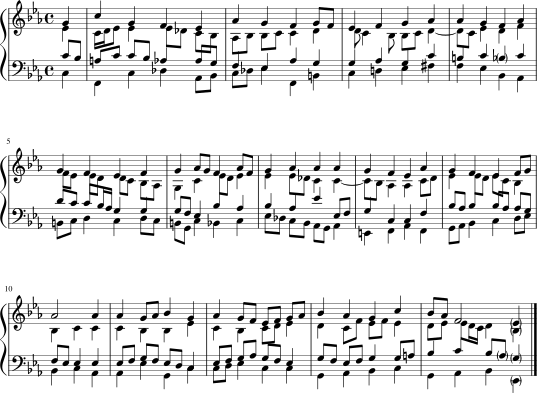
</td>
</tr>
<tr>
<td>

<audio controls>
<source src="exemples/reharmonizations_sameseq/BWV251_var_1.ogg">
</audio>

</td>
</tr>
</table>

 
Variation #2:

<table>
<tr>
<td>
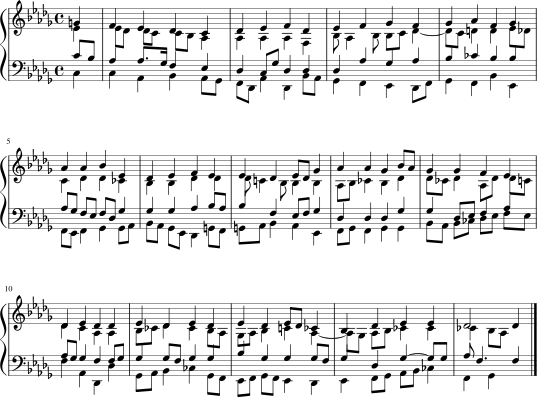
</td>
</tr>
<tr>
<td>

<audio controls>
<source src="exemples/reharmonizations_sameseq/BWV251_var_2.ogg">
</audio>

</td>
</tr>
</table>

___

## Variations of a full chorale with *Distilled VQ-VAE*
Original chorale:

<table>
<tr>
<td>

</td>
</tr>
<tr>
<td>

<audio controls>
<source src="exemples/reharmonizations_distill/BWV215_original.ogg">
</audio>

</td>
</tr>
</table>

Variation #1:

<table>
<tr>
<td>
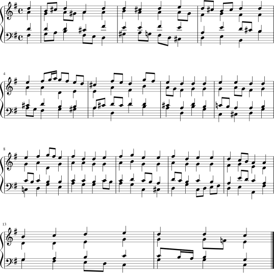
</td>
</tr>
<tr>
<td>

<audio controls>
<source src="exemples/reharmonizations_distill/BWV215_student_var1.ogg">
</audio>

</td>
</tr>
</table>

 
Variation #2:

<table>
<tr>
<td>
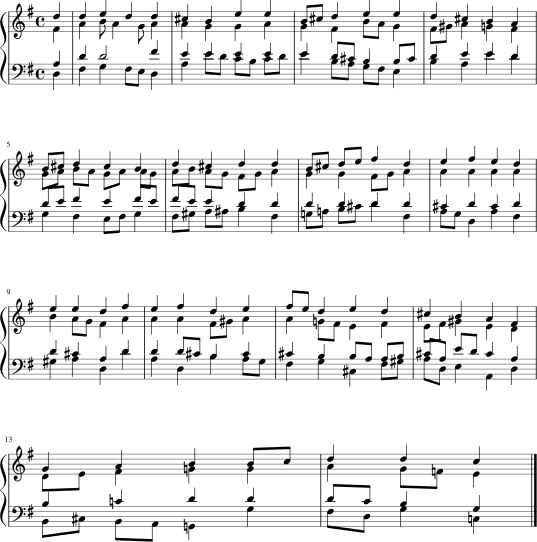
</td>
</tr>
<tr>
<td>

<audio controls>
<source src="exemples/reharmonizations_distill/BWV215_student_var2.ogg">
</audio>

</td>
</tr>
</table>

